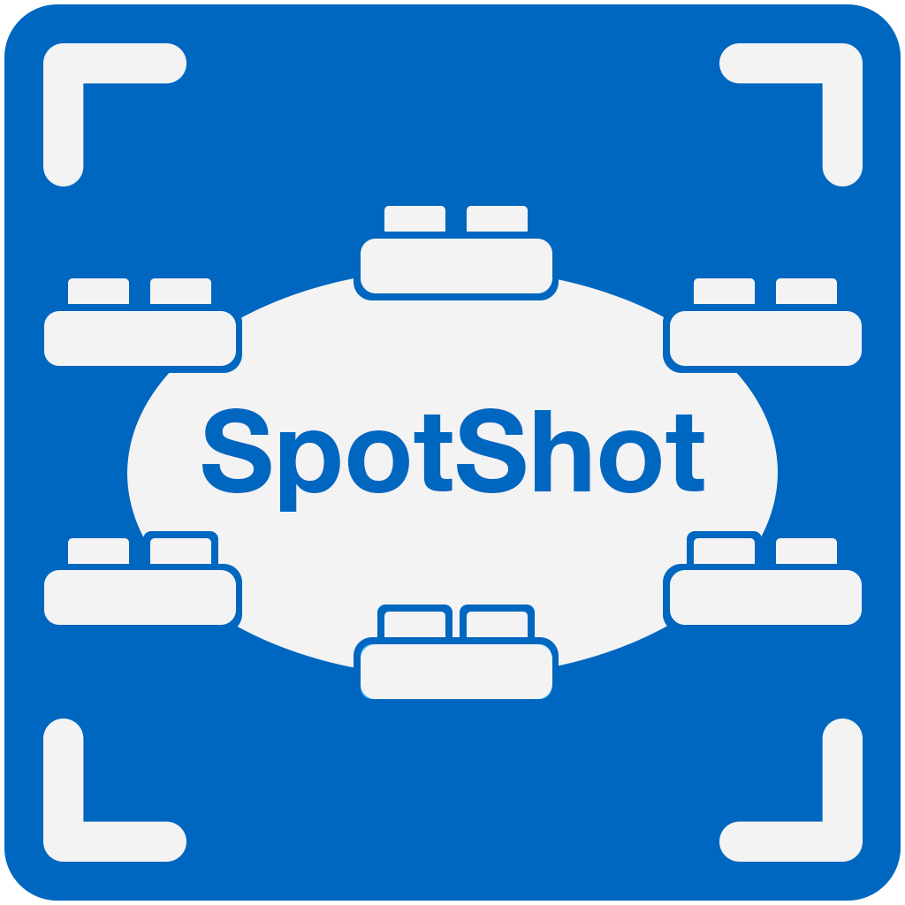

  <picture>
    <source media="(prefers-color-scheme: dark)" srcset="assets/logo-dark.png">
    
  </picture>

<h1 align="center">SpotShot</h1>

  <b>Одно нажатие. Весь спот.</b> 
  Скриншоты, файлы с деталями раздач, структуры турниров и библиотека для ваших ICM-спотов на Windows.

  <a href="https://github.com/spotshotgg/spotshot/releases/latest/download/SpotShot-installer.exe"><b>Скачать для Windows</b></a>
  &nbsp;·&nbsp; <a href="https://spotshot.gg/ru/">spotshot.gg</a>
  &nbsp;·&nbsp; <a href="https://spotshot.gg/ru/changelog/">Обновления</a>
  &nbsp;·&nbsp; <a href="https://discord.gg/jgjeKYsAnS">Discord</a>
  &nbsp;·&nbsp; <a href="README.md">English</a>

## Что умеет SpotShot

Нажмите одну клавишу за столом. SpotShot сам захватит стол, откроет лобби и захватит его вместе с
выплатами, а затем объединит скриншоты в один снимок. Когда вы закончите покерную сессию и покерные клиенты будут полностью
закрыты, то он проанализирует каждый снимок на вашем ПК:

- **Создаёт файл с деталями раздачи (.txt)** и **файл структуры турнира (.json)** для каждого
  спота, готовые к импорту в HRC и GTO Wizard.
- **Все цифры посчитаны:** нокауты игроков в BB, общее количество фишек в турнире и средний сундук mystery bounty
  считаются автоматически.
- **Анонимный режим:** при анализе спота можно скрыть на снимке свой ник и ники других игроков.
- **Библиотека спотов:** каждый спот описан и отсортирован, его можно найти по позиции, стеку, стадии, своим картам, руму или своему тегу, с заметками и редактором PDF-презентации для каждого спота. Отправьте спот, результаты поиска или всю библиотеку другу или
  тренеру одним .zip.

Работает с GGPoker, PokerStars, PartyPoker, 888poker, ACR, Winamax, WPT Global, CoinPoker,
iPoker (Red Star), PokerDom, Chico и QQPK.

## Установка

1. Скачайте **[SpotShot-installer.exe](https://github.com/spotshotgg/spotshot/releases/latest/download/SpotShot-installer.exe)**
   и запустите его. Портативная версия:
   [SpotShot-installer.zip](https://github.com/spotshotgg/spotshot/releases/latest/download/SpotShot-installer.zip).
2. Если Windows пишет **«Система Windows защитила ваш компьютер»**, нажмите **«Подробнее»**, затем
   **«Выполнить в любом случае»**.
3. При запуске SpotShot просит права администратора, чтобы нажимать на кнопку лобби в покерных
   клиентах, запущенных от имени администратора.

Поддерживаются Windows 10 и 11, 64-бит. Больше ничего устанавливать не нужно. Обновления приходят
в приложении.

## Приватность

- Во время игры SpotShot только делает скриншоты. Ничего не анализируется, а библиотека спотов закрыта,
  пока открыт хоть один покерный клиент.
- Аккаунт не нужен, личные данные не хранятся. Ники игроков за столом никогда не сохраняются и не
  попадают в файлы с деталями раздачи.
- Снимки не покидают ваш ПК. SpotShot выходит в интернет только для проверки обновлений и
  периодической проверки доступа.

## Об этом репо

Здесь публикуются официальные версии SpotShot, и отсюда установленные копии получают обновления.
Устанавливайте SpotShot только отсюда или с официального сайта. У каждого релиза есть описание
изменений, оно же доступно на [spotshot.gg](https://spotshot.gg/ru/changelog/). Вопросы, идеи и сообщения
о багах присылайте в [Discord](https://discord.gg/jgjeKYsAnS).

SpotShot не связан ни с одним покер-румом. Названия румов являются товарными знаками их владельцев.
